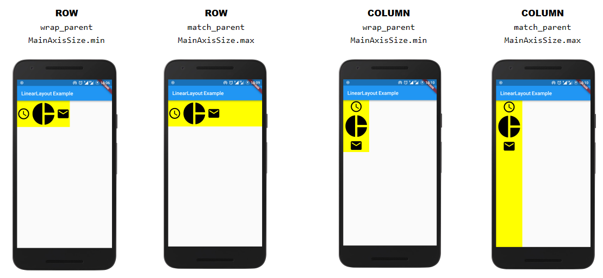

# Basic Widget


- `Text`: style 적용된 text 출력
- `Row`, `Column`: 가로, 세로 방향 layout
- `Stack`: 그리는 순서로 쌓으며 배치.`Posutuibed` 위젯을 사용하여 상대적인 top, right, bottom, left로 위치 시킬 수 있다.
- `Container`: 직사각형 element로 BoxDecoration을 통해 background, border, shadow 등을 설정할 수 있다. margin, padding, size 설정도 가능하다. 3차원으로도 변형 가능하다.


- ```dart
  // Expanded 는 child widget으로 남은영역을 채웁니다. 
  ```


## Row, Column

### Orientation

- LinearLayout: android:orientaion="horizontal"/"vertical"` <=> Row / Column

- android에서 LinearLayout 아래 child view가 있는 것 처럼 Row / Column도 children property로 child widget을 구성한다.

  

- Row의 경우 Main Axis가 가로, Cross Axis가 세로

- Column은 Main Axis가 세로,  Cross Axis가 가로


### match_parent, wrap_content




### 정렬하기

- MainAxisAlignment
- CrossAxisAlignment
- https://beomseok95.tistory.com/310


## Expanded, Flex


## [참고]

- https://flutter.dev/docs/development/ui/widgets-intro#basic-widgets
- https://proandroiddev.com/flutter-for-android-developers-how-to-design-linearlayout-in-flutter-5d819c0ddf1a
- https://api.flutter.dev/flutter/widgets/Row-class.html
- https://api.flutter.dev/flutter/widgets/Expanded-class.html
- http://murmurblog.com/flutter-widget/
- https://here4you.tistory.com/120

